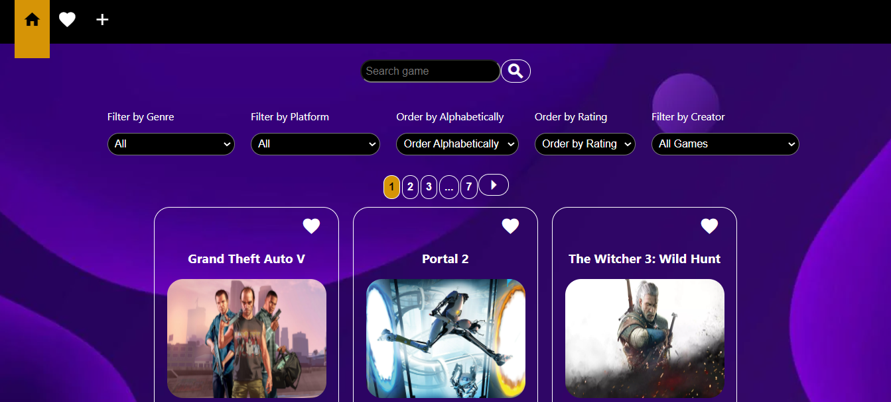
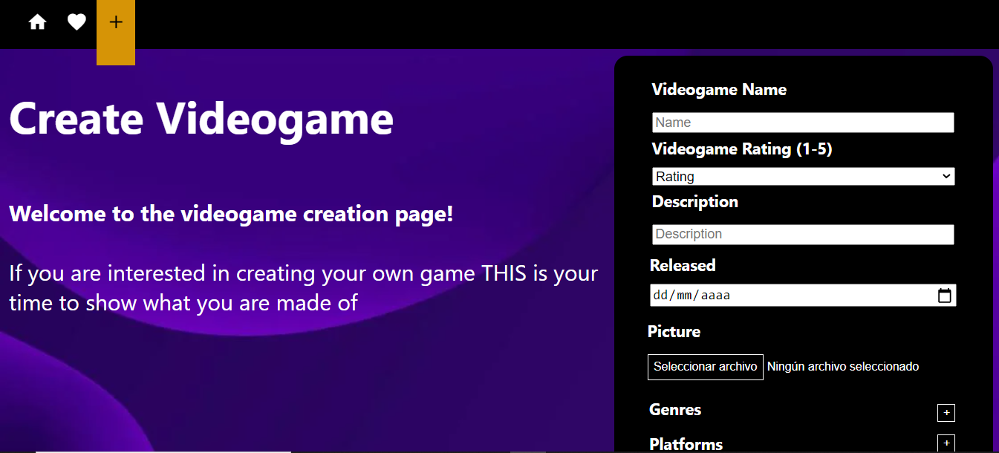
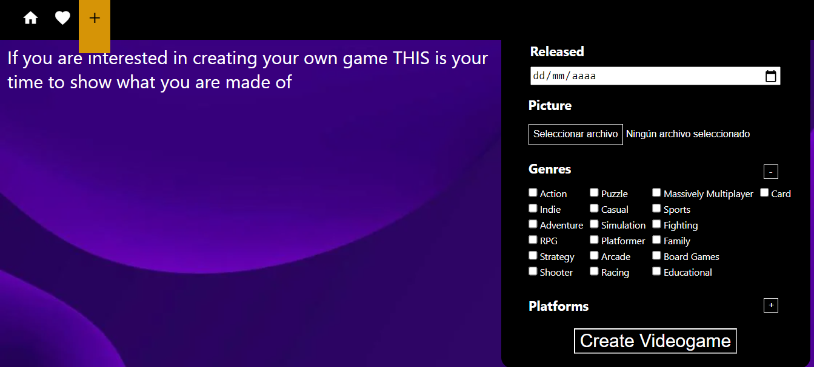
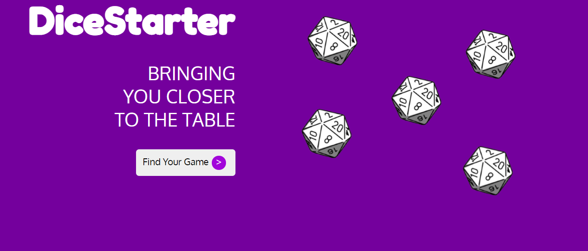
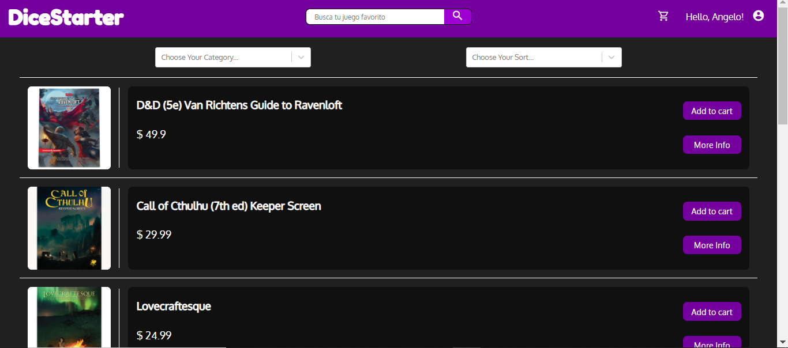
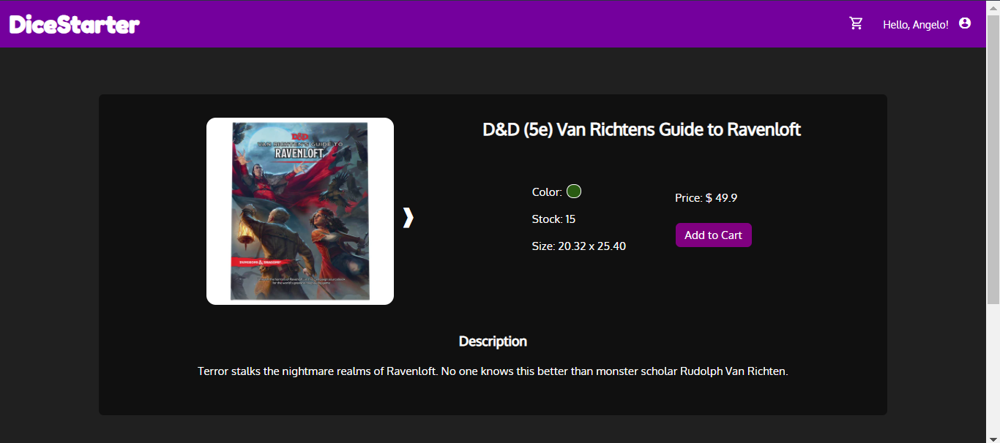
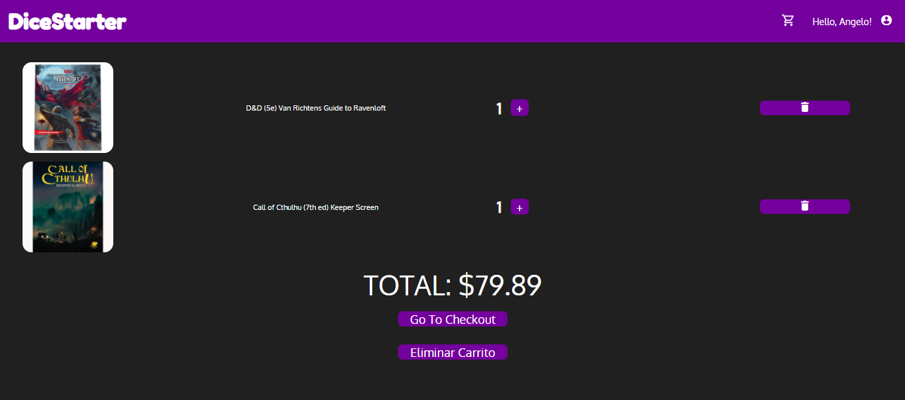
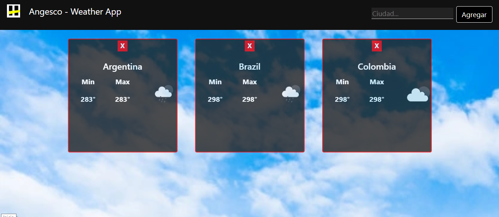

#  Hello, my name is Angelo Escobar

I'm a Full-stack developer.

I like everything related to analysis and logic (for this same reason is that I feel more familiar with Back end development), I am a very organized person, I adapt to any environment and I am at the height of any problem that arises or pose me.
I really like to read, my favorite author is John Katzenbach and, despite having several books by him, I consider that the best of all is "The Psychoanalyst".
In my free time I like to share with friends and play the play.
Currently I work as a Back Office, my function is to analyze cases generated from the Front Office in order to be able to solve them as soon as possible

## Skills:

 

 

 

 

 

 

 

 

 
And more...

## Some projects:

• Videogames-App

 

• DiceStarter

 

 

• Weather-App

• Movies

## Find me at:

## Contact me:

 

